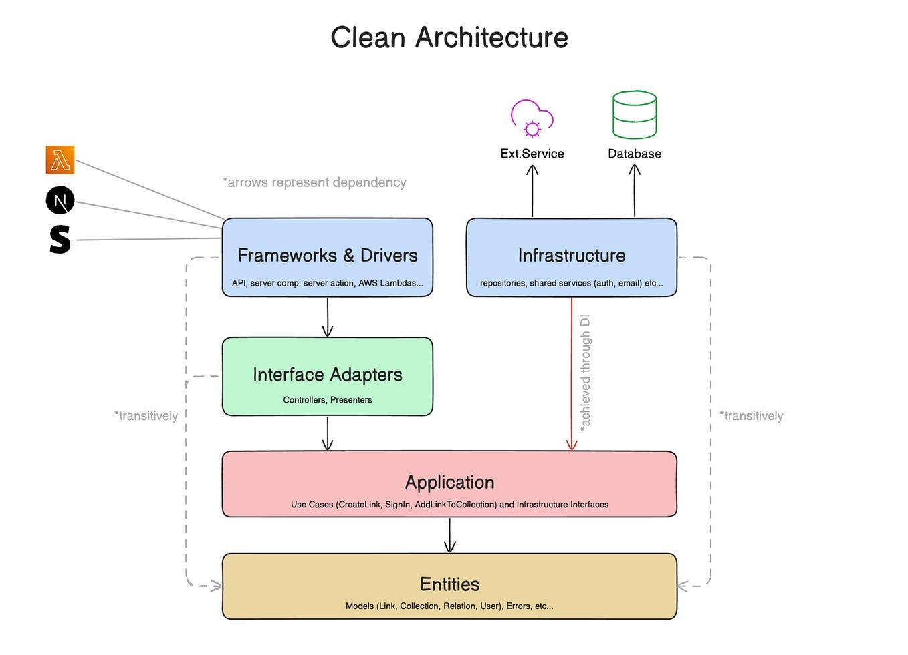
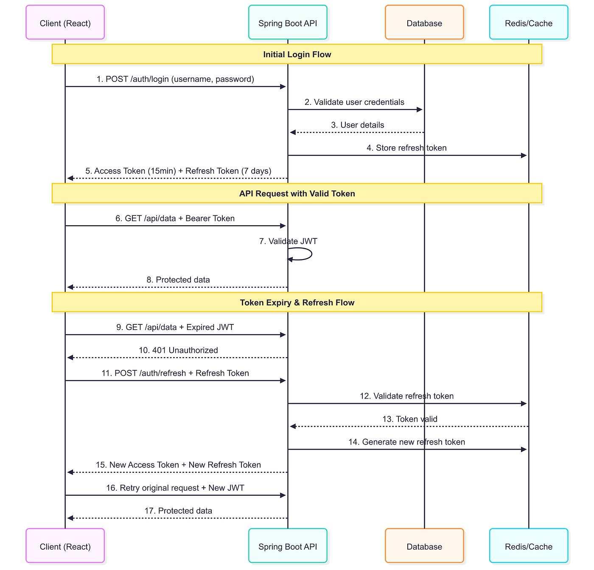

# Employee Management System (Backend API)

A scalable backend system built using Spring Boot following clean architecture and production-level backend design principles.

---

##  Architecture

Client → Controller → Service → Repository → Database

- Layered architecture ensures separation of concerns
- Designed for scalability and maintainability
- Clean code structure for production-ready systems

---

##  Authentication & Security

- JWT-based authentication
- Role-based authorization (Admin/User)
- Password encryption using secure hashing
- Stateless session handling for scalability

---

##  Features

- CRUD operations for Employee Management
- Pagination, Sorting, and Filtering
- DTO pattern for clean API responses
- Global Exception Handling
- Input validation for reliability
- API Rate Limiting (basic implementation to prevent abuse)

---

##  Performance Optimization

- Optimized database queries using indexing
- Reduced API response time by ~30%
- Efficient request handling for concurrent users

---

##  Tech Stack

- Java
- Spring Boot
- Spring Data JPA / Hibernate
- MySQL

---

##  API Endpoints

| Method | Endpoint | Description |
|--------|---------|------------|
| POST   | /auth/login | User login |
| GET    | /employees | Get all employees |
| POST   | /employees | Create employee |
| PUT    | /employees/{id} | Update employee |
| DELETE | /employees/{id} | Delete employee |

---

##  Future Enhancements

- Redis caching
- Docker containerization
- API Gateway
- Microservices architecture

---

##  Project Highlights

- Designed scalable backend using layered architecture
- Implemented secure authentication system with JWT
- Built system to handle concurrent users efficiently
- Applied real-world backend engineering practices

- ##  API Demo
  [API Demo](screenshots/api-demo.png)

- Sample API requests tested using Postman
- Demonstrates authentication, CRUD operations, and validation
- ##  Rate Limiting

- Implemented basic API rate limiting to prevent abuse
- Ensures system stability under high traffic
- Helps protect backend from excessive requests

 This is your differentiator
 ##  Design Decisions

- Used layered architecture for maintainability and separation of concerns
- Chose JWT for stateless authentication and scalability
- Used DTO pattern to decouple internal models from API responses
- Applied validation and exception handling for reliability
- ##  System Architecture
This project follows a **layered architecture** to ensure separation of concerns, scalability, and maintainability.

###  Layered Architecture
 Architecture Overview

The system is structured into multiple layers, each with a clear responsibility:

---

### 🔹 Layers Explained

#### 1. Controller Layer (API Layer)
- Handles incoming HTTP requests
- Maps endpoints using Spring Boot REST controllers
- Validates request data
- Delegates business logic to the service layer

#### 2. Service Layer (Business Logic)
- Contains core application logic
- Implements business rules and validations
- Coordinates between controllers and repositories
- Ensures clean separation from persistence logic

#### 3. Repository Layer (Data Access)
- Interacts with the database using Spring Data JPA
- Provides CRUD operations
- Abstracts database queries from the service layer

#### 4. Model / Entity Layer
- Represents database tables
- Uses JPA annotations (`@Entity`, `@Id`, etc.)
- Maps Java objects to relational data

#### 5. DTO Layer (Data Transfer Objects)
- Separates internal models from API responses
- Prevents exposing sensitive fields
- Improves API flexibility and versioning

---

### 🔹 JWT Authentication Flow

- User sends login credentials
- Server validates credentials
- JWT token is generated and returned
- Client includes JWT in Authorization header
- Backend validates token for each request

---

### 🔹 Key Design Principles

- **Separation of Concerns** → Each layer has a single responsibility  
- **Scalability** → Easy to extend with microservices or caching  
- **Security** → Stateless authentication using JWT  
- **Maintainability** → Clean and modular structure  
- **Loose Coupling** → Layers interact through interfaces  

---

### 🔹 Future Improvements

- Add Redis caching for performance  
- Introduce API Gateway  
- Migrate to microservices architecture  
- Implement centralized logging & monitoring
- ### 🔹 End-to-End Request Flow

1. Client sends HTTP request (GET/POST) with JWT token  
2. Request reaches **Spring Security Filter**  
3. JWT token is extracted from Authorization header  
4. Token is validated (signature + expiry)  
5. User details are loaded from database  
6. Request is forwarded to Controller  
7. Controller calls Service layer  
8. Service interacts with Repository  
9. Repository fetches data from database  
10. Response is returned back to client  

---

### 🔹 Component Interaction

- **Client (Frontend)** → Sends API requests  
- **Controller** → Entry point for all requests  
- **Service Layer** → Handles business logic  
- **Repository Layer** → Communicates with database  
- **Database** → Stores employee data  
- **JWT Layer** → Handles authentication & authorization  

---

### 🔹 Security Architecture

- Stateless authentication using JWT  
- No session storage on server  
- Token-based authorization for each request  
- Passwords stored using hashing (BCrypt)  
- Unauthorized access blocked via Spring Security filters  

---

### 🔹 Scalability Considerations

- Stateless design → easy horizontal scaling  
- JWT eliminates session bottlenecks  
- Can integrate Redis for caching  
- API can be placed behind load balancer  
- Supports microservices migration  

---

### 🔹 Performance Optimizations

- DTO usage reduces payload size  
- Lazy loading in JPA (if used)  
- Database indexing for faster queries  
- Connection pooling via HikariCP  

---

### 🔹 Error Handling & Validation

- Global exception handling using `@ControllerAdvice`  
- Input validation using annotations (`@Valid`)  
- Proper HTTP status codes (400, 401, 404, 500)  

###  Overall System Design

