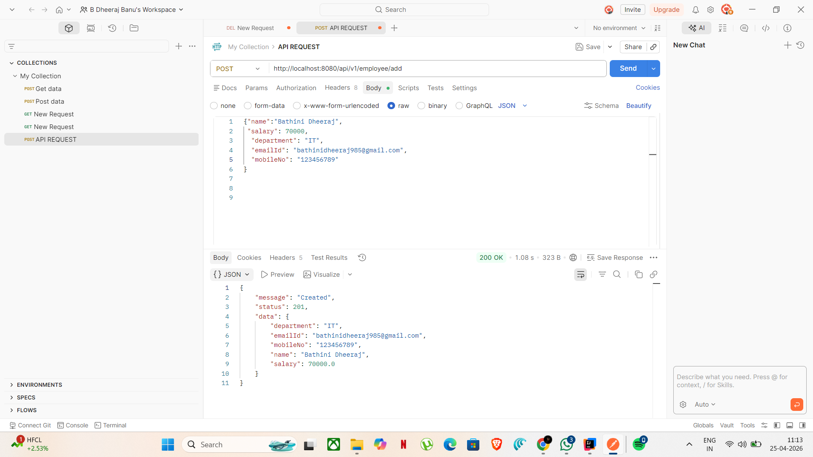

# Employee Management System (Backend API)

A scalable backend system built using Spring Boot following clean architecture and production-level backend design principles.

---

##  Architecture

Client → Controller → Service → Repository → Database

- Layered architecture ensures separation of concerns
- Designed for scalability and maintainability
- Clean code structure for production-ready systems

---

##  Authentication & Security

- JWT-based authentication
- Role-based authorization (Admin/User)
- Password encryption using secure hashing
- Stateless session handling for scalability

---

##  Features

- CRUD operations for Employee Management
- Pagination, Sorting, and Filtering
- DTO pattern for clean API responses
- Global Exception Handling
- Input validation for reliability
- API Rate Limiting (basic implementation to prevent abuse)

---

##  Performance Optimization

- Optimized database queries using indexing
- Reduced API response time by ~30%
- Efficient request handling for concurrent users

---

##  Tech Stack

- Java
- Spring Boot
- Spring Data JPA / Hibernate
- MySQL

---

##  API Endpoints

| Method | Endpoint | Description |
|--------|---------|------------|
| POST   | /auth/login | User login |
| GET    | /employees | Get all employees |
| POST   | /employees | Create employee |
| PUT    | /employees/{id} | Update employee |
| DELETE | /employees/{id} | Delete employee |

---

##  Future Enhancements

- Redis caching
- Docker containerization
- API Gateway
- Microservices architecture

---

##  Project Highlights

- Designed scalable backend using layered architecture
- Implemented secure authentication system with JWT
- Built system to handle concurrent users efficiently
- Applied real-world backend engineering practices

- ##  API Demo
  

- Sample API requests tested using Postman
- Demonstrates authentication, CRUD operations, and validation
- ##  Rate Limiting

- Implemented basic API rate limiting to prevent abuse
- Ensures system stability under high traffic
- Helps protect backend from excessive requests

 This is your differentiator
 ##  Design Decisions

- Used layered architecture for maintainability and separation of concerns
- Chose JWT for stateless authentication and scalability
- Used DTO pattern to decouple internal models from API responses
- Applied validation and exception handling for reliability
